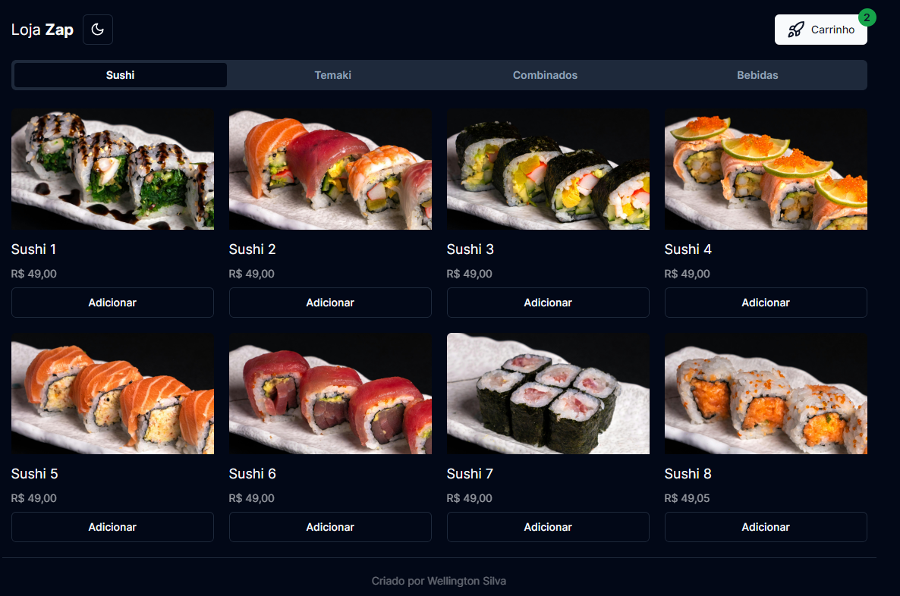

# Loja Zap

- Next.Js
- Typescript
- Shadcn/ui
- Tailwind CSS
- Theme Dark/Light
- Zustand



## Executando o projeto:
- Para executar o projeto, siga estas etapas:

## Comandos:
- Instale as dependências do projeto:
- npm i ou yarn install

## Execute o servidor de desenvolvimento:

```bash
npm run dev
# or
yarn dev
# or
pnpm dev
# or
bun dev
```

Open [http://localhost:3000](http://localhost:3000) with your browser to see the result.


